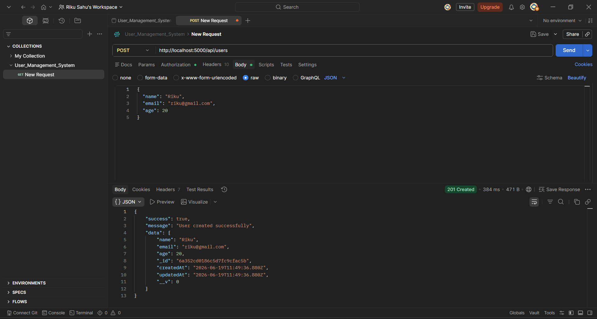
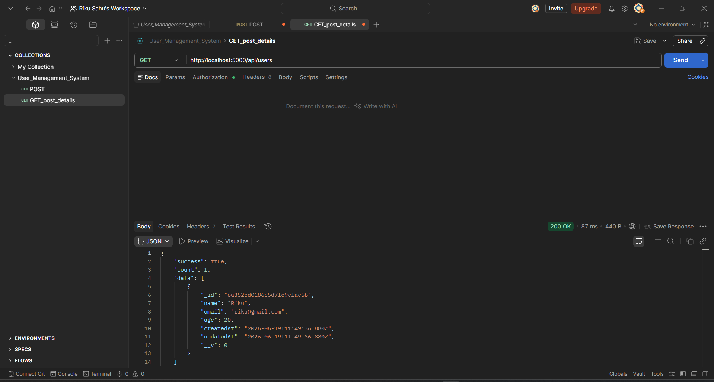
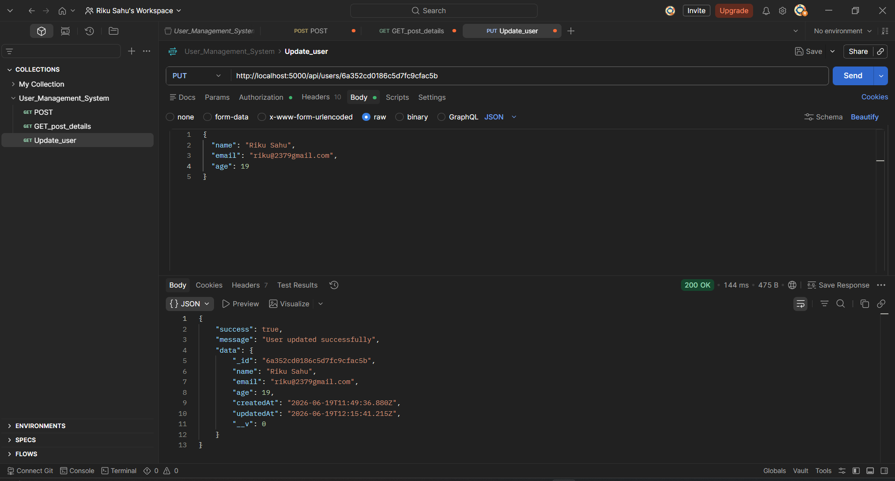
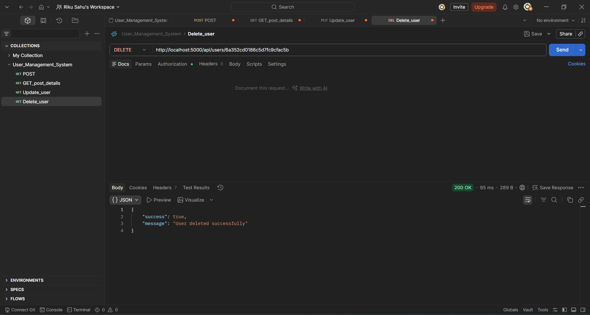
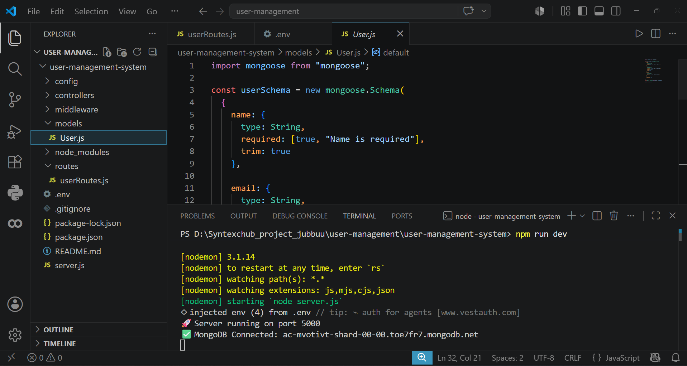
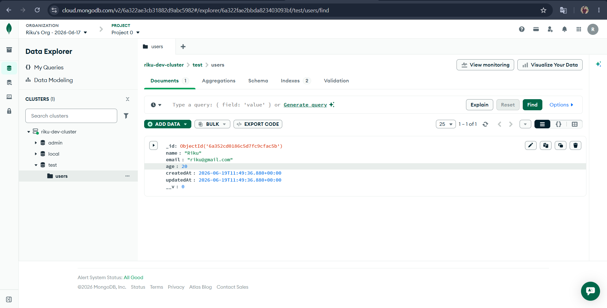

<div align="center">

# 🔐 Syntecxhub User Management System

**A RESTful API for User Management — built with Node.js, Express, MongoDB & Mongoose**

[](https://nodejs.org/)
[](https://expressjs.com/)
[](https://www.mongodb.com/)
[](https://mongoosejs.com/)
[](https://www.postman.com/)
[](#-license)

<br/>

[📂 Repository](https://github.com/ItsRiku237/Syntecxhub_User_Management_System) &nbsp;·&nbsp; [🐛 Report Bug](https://github.com/ItsRiku237/Syntecxhub_User_Management_System/issues) &nbsp;·&nbsp; [✨ Request Feature](https://github.com/ItsRiku237/Syntecxhub_User_Management_System/issues)

</div>

---

## 🚀 Live Demo

🌐 https://syntecxhub-user-management-system-3hdq.onrender.com

---

## 🖼 API Screenshots (Postman)

### ✅ POST — Create User


### ✅ GET — Read User


### ✅ PUT — Update User


### ✅ DELETE — Delete User


### 🖥️ VS Code — Project Setup


### 🖥️ Mongodb connection — POST Record


---

## 📖 Table of Contents

- [About the Project](#-about-the-project)
- [Features](#-features)
- [Tech Stack](#-tech-stack)
- [Project Structure](#-project-structure)
- [API Endpoints](#-api-endpoints)
- [Authentication](#-authentication)
- [Getting Started](#-getting-started)
- [Testing with Postman](#-testing-with-postman)
- [Future Improvements](#-future-improvements)
- [Developer](#-developer)
- [Acknowledgements](#-acknowledgements)

---

## 🎯 About the Project

**Syntecxhub User Management System** is a RESTful API built to manage user data with full **CRUD (Create, Read, Update, Delete)** functionality. Developed as part of the **Syntecxhub Web Development Internship**, this project demonstrates backend fundamentals — REST API design, MongoDB schema modeling with Mongoose, and securing endpoints using HTTP Basic Authentication.

All endpoints were tested and verified using **Postman**, with results documented via screenshots in this repository.

> 🔒 Every protected route requires a valid **username & password** sent via the `Authorization` header (Basic Auth).

---

## ✨ Features

| Feature | Description |
|--------|-------------|
| ➕ Create User | `POST` endpoint to add a new user to the database |
| 📖 Read User(s) | `GET` endpoint to fetch single or all users |
| ✏️ Update User | `PUT` endpoint to update existing user details |
| 🗑️ Delete User | `DELETE` endpoint to remove a user from the database |
| 🔐 Basic Authentication | Protects routes using HTTP Basic Auth (username/password header) |
| 🗄️ MongoDB + Mongoose | Schema-based data modeling and storage |
| 🧪 Postman Tested | All endpoints verified with request/response screenshots |
| ⚠️ Error Handling | Proper status codes & error messages for invalid requests |

---

## 🛠 Tech Stack

| Category         | Technology        |
|-------------------|-------------------|
| Runtime           | Node.js           |
| Framework         | Express.js        |
| Database          | MongoDB           |
| ODM               | Mongoose          |
| Authentication    | HTTP Basic Auth   |
| API Testing       | Postman           |
| Version Control   | Git & GitHub      |

---

## 📁 Project Structure
```

Syntecxhub_User_Management_System/
│
├── config/
│   └── db.js                      # MongoDB connection setup
│
├── models/
│   └── User.js                    # Mongoose schema for User
│
├── routes/
│   └── userRoutes.js              # All CRUD route definitions
│
├── controllers/
│   └── userController.js          # CRUD logic (Create, Read, Update, Delete)
│
├── middleware/
│   └── auth.js                    # HTTP Basic Authentication middleware
│
├── screenshots/                   # Postman + VS Code screenshots
│   ├── POST_create_user.png       # POST - Create User
│   ├── GET_read_user.png          # GET - Read User
│   ├── PUT_update_user.png        # PUT - Update User
│   ├── DELETE_user.png            # DELETE - Delete User
│   ├── Mongodb_conection.png      # VS Code project setup
|   └── Mongodb_POST_record.png    # Mongodb post record
│
├── .env                           # Environment variables (DO NOT COMMIT)
├── .gitignore                     # Files excluded from Git
├── package.json                   # Project metadata & dependencies
├── package-lock.json              # Locked dependency tree
├── server.js                      # App entry point
└── README.md                      # Project documentation

```
---

## 🔗 API Endpoints

| Method   | Endpoint           | Description           | Auth Required |
|----------|---------------------|------------------------|----------------|
| `POST`   | `/api/users`         | ✅ Create a new user   | Yes |
| `GET`    | `/api/users`         | ✅ Get all users       | Yes |
| `GET`    | `/api/users/:id`     | ✅ Get a single user   | Yes |
| `PUT`    | `/api/users/:id`     | ✅ Update a user       | Yes |
| `DELETE` | `/api/users/:id`     | ✅ Delete a user       | Yes |

### Example Request Body (POST / PUT)
```json
{
  "name": "Riku Sahu",
  "email": "riku@example.com",
  "password": "yourpassword",
  "age": 20
}
```

---

## 🔐 Authentication

This API uses **HTTP Basic Authentication**. Every request to a protected route must include an `Authorization` header.

**In Postman:**
1. Go to the **Authorization** tab
2. Select type → **Basic Auth**
3. Enter your **Username** and **Password**
4. Postman automatically encodes it into the request header

**Header format (auto-generated):**
---

## 🚀 Getting Started

### Prerequisites

- [Node.js](https://nodejs.org/) — v16 or higher
- [MongoDB](https://www.mongodb.com/try/download/community) (local) or [MongoDB Atlas](https://www.mongodb.com/cloud/atlas) (cloud)
- [Postman](https://www.postman.com/downloads/) — for testing
- [Git](https://git-scm.com/)

### Installation

**1. Clone the repository**
```bash
git clone https://github.com/ItsRiku237/Syntecxhub_User_Management_System.git
```

**2. Navigate into the project**
```bash
cd Syntecxhub_User_Management_System
```

**3. Install dependencies**
```bash
npm install
```

**4. Create a `.env` file in the root directory**
```env
PORT=5000
MONGO_URI=your_mongodb_connection_string
BASIC_AUTH_USERNAME=admin
BASIC_AUTH_PASSWORD=yourpassword
```

**5. Start the server**
```bash
npm start
```

Server runs at → `http://localhost:5000`

---

## 🧪 Testing with Postman

1. Open **Postman**
2. Create a new request
3. Set the method (`GET`, `POST`, `PUT`, `DELETE`) and URL (e.g. `http://localhost:5000/api/users`)
4. Go to **Authorization** tab → select **Basic Auth** → enter credentials
5. For `POST`/`PUT`, go to **Body** → select **raw** → **JSON** → paste user data
6. Click **Send** and check the response

> 📸 See the [API Screenshots](#-api-screenshots-postman) section above for real request/response examples.

---

## 📈 Future Improvements

- [ ] 🔑 Switch to JWT-based authentication
- [ ] 🔒 Password hashing with bcrypt
- [ ] 📄 Pagination for `GET /api/users`
- [ ] 🧪 Add automated tests (Jest / Mocha)
- [ ] ☁️ Deploy to Render / Railway
- [ ] 📘 Add Swagger / OpenAPI documentation
- [ ] 🛡️ Input validation with Joi or express-validator

---

## 👨‍💻 Developer

<div align="center">

**Riku Sahu**

B.Tech Computer Science & Engineering — GCE Kalahandi
Web Development Intern @ Syntecxhub

[](https://github.com/ItsRiku237)

</div>

---

## 🙏 Acknowledgements

- [Syntecxhub](https://syntecxhub.com) — for the hands-on internship program
- [Express.js Docs](https://expressjs.com/) — routing & middleware reference
- [Mongoose Docs](https://mongoosejs.com/docs/) — schema & ODM reference
- [MongoDB Docs](https://www.mongodb.com/docs/) — database reference
- [Postman](https://www.postman.com/) — API testing tool

---

## 📄 License

This project is developed for **educational and internship purposes** under the Syntecxhub Web Development Internship Program.

---

<div align="center">

Made with ❤️ by **Riku Sahu** &nbsp;|&nbsp; Syntecxhub Internship 2025–26

</div>
